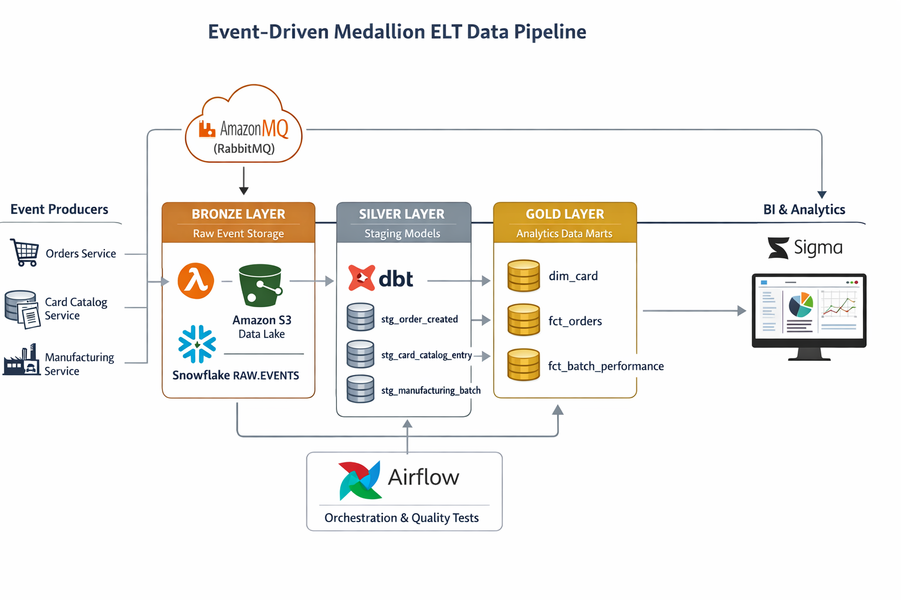

# Technical Design Document
## Sports Card Analytics Platform
### Event-Driven Medallion (Bronze–Silver–Gold) ELT Architecture

## Introduction
This document describes the design of the Sports Card Analytics Platform, a data engineering solution that supports analytical use cases for Product, Marketing, and Operations teams. Operational services including Orders, Card Catalog, and Manufacturing emit event-driven data through RabbitMQ (AmazonMQ), with historical events archived in a PostgreSQL event journal. The platform transforms these events into reliable analytical datasets that power Sigma dashboards on Snowflake.

The platform’s goal is to transform these event streams into reliable analytical datasets that power Sigma dashboards built on Snowflake. Product teams will use these datasets to analyze demand by SKU, player, and team. Marketing will use them to understand revenue and customer purchasing behavior. Operations will evaluate manufacturing throughput, defect rates, and batch efficiency. The main stakeholders are data engineers, analytics engineers, analysts, and business leaders who depend on accurate, timely insights generated by this platform.

## Design Goals and Constraints
The platform is designed to be a scalable, resilient, and auditable system built on modern data engineering patterns. It must support both streaming ingestion from RabbitMQ and historical backfills from PostgreSQL, ensuring that analytical data is complete and correct. Another important design goal is supporting replayability, meaning that raw input data can be reprocessed if transformation logic changes in the future.

The solution must operate within several constraints. RabbitMQ and PostgreSQL are fixed sources and cannot be replaced. Snowflake must be the analytical warehouse and Sigma the BI layer. Airflow is required for orchestration, and dbt must be used for modeling and transformation. Events are represented as protobuf messages, which constrains how schemas evolve and how numeric precision is handled. Event delivery semantics are at-least-once rather than exactly-once, which drives the need for downstream deduplication and idempotency.

## Architectural Overview
The architecture follows an event-driven Medallion (RAW–STAGING–MART) ELT pattern. Real-time and historical ingestion paths land events into an Amazon S3 raw zone (Bronze layer). Data is loaded into Snowflake RAW tables, transformed by dbt into STAGING (Silver) models, and curated into MART (Gold) tables consumed by Sigma dashboards. This layered design separates ingestion, storage, transformation, and consumption concerns. It supports incremental processing, schema evolution, data lineage, reproducibility, and operational simplicity.

Airflow orchestrates ingestion backfills, Snowflake loading jobs, dbt transformations, and data quality checks, providing observability and controlled execution.

## Functional Requirements
The system must ingest live and historical events, persist raw data to S3 and Snowflake, transform events into analytical datasets, handle deduplication and schema evolution, and publish reliable MART tables for analytics consumption.

The platform must continuously ingest live events from RabbitMQ and ingest historical events from PostgreSQL’s events table. It must be able to land raw event data to S3 and then load it to Snowflake. It must transform raw events into analytical datasets that describe card orders, manufacturing batches, and card catalog attributes. The system must ensure that event duplication does not inflate metrics, handle schema evolution safely, and perform incremental refreshes rather than full reloads where possible.

Outputs of the platform include Snowflake MART tables, data quality indicators surfaced through dbt tests, and dashboards in Sigma built on top of these datasets.

## Non-Functional Requirements
The system must scale with increasing event volume without major architectural changes. It should tolerate failures while preserving data integrity. Replayable ingestion and layered data storage provide resilience against errors in transformation logic and downstream outages. Performance must be sufficient for interactive BI while controlling cost through Snowflake auto-suspend and incremental processing.

Security requirements include encryption in transit, least-privilege IAM roles, secure Snowflake roles, and credential management through Airflow connections. The platform must provide observability via Airflow logs, dbt run outputs, and Snowflake load monitoring. The design must handle schema evolution gracefully, particularly due to protobuf messages adding new fields over time.

## Data Design
RAW tables store original event payloads, STAGING models normalize and type data, and MART tables such as dim_card, fct_orders, and fct_batch_performance are optimized for analytical joins and aggregations.

The platform is event-centric. Data originates as protobuf or JSON payloads describing orders, manufacturing batches, and card catalog entries. Snowflake RAW tables store original payloads. Staging models cast them into structured columns. MART models produce facts and dimensions designed for analytical joins rather than transaction processing.

The dim_card table describes SKU-level attributes such as player, sport, parallel, and print run. The fct_orders table stores order-level measures including quantity, price, and revenue. The fct_batch_performance table stores batch-level production volume and defect rates.

Analytical queries are primarily aggregations over fact tables, joined to dim_card for descriptive attributes. Snowflake’s optimizer and built-in caching minimize the need for explicit application caching.

## System Components and Modules
Core components include RabbitMQ, PostgreSQL, Amazon S3, Snowflake, dbt, Airflow, and Sigma. Each component follows a clear single-responsibility principle.

## APIs and Interfaces
The platform consumes events from AmazonMQ (RabbitMQ engine) using the AMQP protocol. PostgreSQL is accessed via SQL, raw data is written to Amazon S3 using AWS APIs, and Snowflake is accessed through SQL-based connectors.

## Algorithms and Design Patterns
The design applies event sourcing, ELT processing, medallion layering, idempotent ingestion, incremental dbt modeling, and deterministic protobuf decimal handling.

## Error Handling and Exception Management
Errors are logged and isolated without blocking ingestion. Invalid events are quarantined. dbt tests enforce data quality, and recovery relies on replaying immutable raw data.

## Testing and Quality Assurance
Quality is enforced through dbt tests, end-to-end ingestion validation, reconciliation checks, and analytical performance testing. Data quality is enforced through dbt tests including uniqueness, non-null, and referential integrity checks. Integration tests validate end-to-end ingestion through Airflow. Historical versus real-time row counts can be reconciled to detect gaps. Query performance validation ensures that MART tables support responsive analytics. Security configurations and permissions are reviewed in deployment checklists.

## Deployment and Release Strategy
The system follows environment-based promotion: development, staging, and production. Code is version-controlled in Git. Deployment consists of updating dbt models, Airflow DAGs, and Snowflake DDLs. Releases are staged, validated, and then promoted. Rollback is straightforward because data is stored immutably; MART tables can be rebuilt from RAW layers if transformations must be reverted.

## Assumptions, Tradeoffs, and Future Work
Assumptions include immutable events and at-least-once delivery semantics. Tradeoffs favor ELT over ETL, medallion layering over flat schemas, and managed ingestion over scheduler-based consumption. Future work includes schema registries, anomaly detection, real-time ingestion, cost optimization, and ML use cases.

## Conclusion
This design delivers a durable, replayable, and scalable analytics platform aligned with modern data engineering best practices and business analytics needs.
